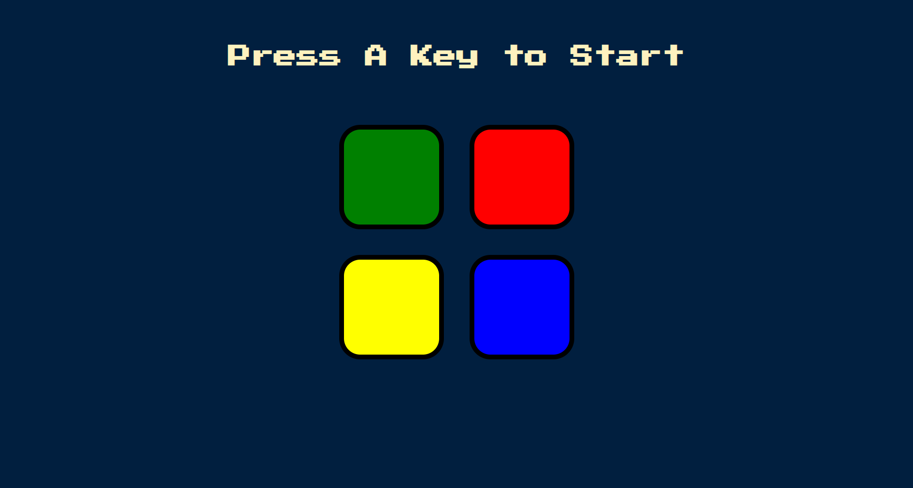
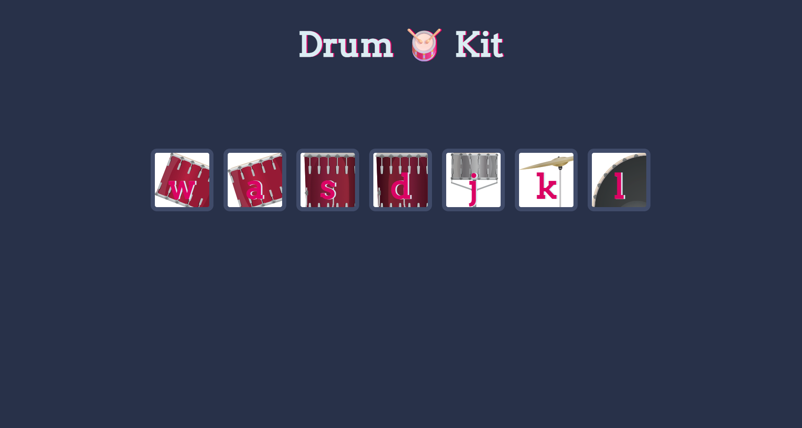
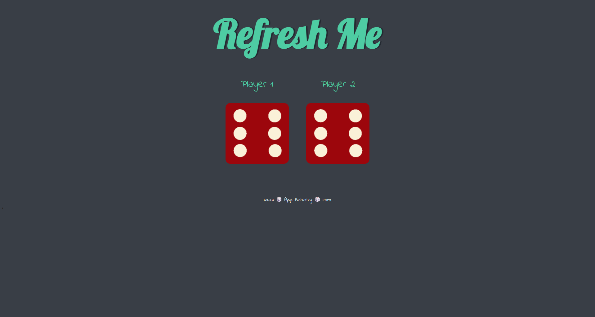

# Hi, I'm Dor Haboosha 👋

🎓 B.Sc. **Computer Science** + B.A. **Entrepreneurship** (Reichman University)  
🧑‍💻 Aspiring **Software / Full‑Stack / Backend / Frontend Developer**  
🧩 I build learning projects to level up fast — and real apps for myself/family/friends that solve practical needs  
✨ Values: **Clean Code · Testing · Ownership · Product Thinking**  
💡 I enjoy building polished UIs and reliable APIs, with a strong focus on readable, maintainable code.

---

## 🌐 Socials

---

## 🚧 What I’m building now
- 🖥️ **Personal Portfolio Website** — a site to showcase my projects, skills, and contact info  
- 🌱 **Spring Boot Learning API** — a backend API project to learn Spring Boot by building

---

## ✅ Highlights
- ✅ **Projects:** Full‑stack apps, APIs, and OOP exercises  
- ✅ **Strengths:** Clean architecture, testing mindset, strong self‑learning  
- ✅ **Open to:** Junior roles / internships / collaborations

---

## ⭐ Featured Projects (Pinned)
- 🎮 **Video Game Discovery Platform** — Discover games with search, filters, and rich game pages  
  🔗 [Repository](https://github.com/dorhaboosha/Video-Game-Discovery-Platform)

- 📺 **TV Show Recommender AI** — Personalized TV show recommendations using embeddings + similarity  
  🔗 [Repository](https://github.com/dorhaboosha/TV-Show-Recommender-AI)

- 🚗 **Garage Management System** — C#/.NET OOP project with clean separation of UI & logic  
  🔗 [Repository](https://github.com/dorhaboosha/Garage-Management)

- 🧠 **Memory Game** — OOP memory game (logic + UI separation, solid design)  
  🔗 [Repository](https://github.com/dorhaboosha/Memory-Game)

---

## 🖼️ Project Screenshots

### Video Game Discovery Platform

### Simon Game

### Drum Kit

### Dice Game

---

## 💻 Tech Stack

### Programming Languages

### Frameworks / Libraries

### Tools

---

## 📬 Contact
- DM me on LinkedIn: https://www.linkedin.com/in/dor-haboosha/  
- Or email: dorhaboosha1234@gmail.com
